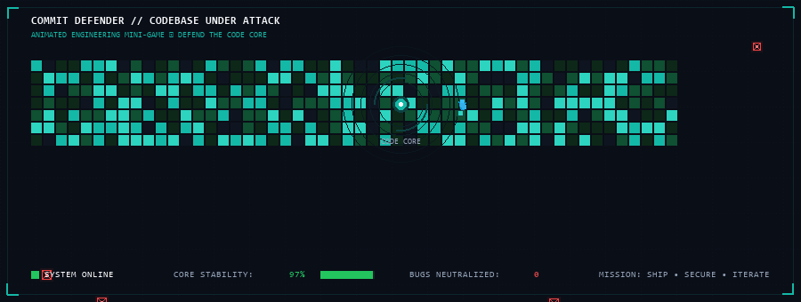

<div align="center">

<!-- ╔══════════════════════════════════════════════════════════════════════════╗ -->
<!-- ║               ✦ SABA NOOR — ULTRA PREMIUM PROFILE v5.0 ✦               ║ -->
<!-- ╚══════════════════════════════════════════════════════════════════════════╝ -->

<!-- ═══════════════════════ ANIMATED HEADER ═══════════════════════ -->


<!-- ═══════════════════════ ANIMATED SOCIAL RIBBON ═══════════════════════ -->

<br/>

<a href="https://github.com/Saba1512006">

</a>
&nbsp;
<a href="mailto:sabarajput672@gmail.com">

</a>
&nbsp;


<br/><br/>

<!-- ═══════════════════════ TYPING ANIMATION ═══════════════════════ -->

<a href="https://git.io/typing-svg">

</a>

<br/>

<!-- ═══════════════════════ PREMIUM TAGLINE ═══════════════════════ -->

<table>
<tr>
<td>

```
 ╔══════════════════════════════════════════════════════════════════════════╗
 ║                                                                          ║
 ║   ⟐  "I don't just write code.                                         ║
 ║       I engineer systems that solve real problems."                      ║
 ║                                                          — Saba Noor    ║
 ╚══════════════════════════════════════════════════════════════════════════╝
```

</td>
</tr>
</table>

<br/>

<!-- ═══════════════════════ DYNAMIC COUNTERS ═══════════════════════ -->


&nbsp;

&nbsp;


<br/>

<!-- ═══════════════════════ QUICK POWER STATS ═══════════════════════ -->

<br/>


</div>

<br/>

<!-- ═══════════════════════════════════════════════════════════════════════ -->
<!-- ═══════════════════════ ✦ SYSTEM INITIALIZATION ✦ ══════════════════ -->
<!-- ═══════════════════════════════════════════════════════════════════════ -->


<div align="center">

</div>

<br/>

```text
╔══════════════════════════════════════════════════════════════════════════════╗
║                                                                              ║
║                    ✦ SABA ENGINEERING CORE v5.0 ✦                           ║
║                                                                              ║
╠══════════════════════════════════════════════════════════════════════════════╣
║                                                                              ║
║  ⬡ STATUS        ● ONLINE                  ⬡ UPTIME      █████████ 99.9%   ║
║  ⬡ ROLE          FULL-STACK SOFTWARE ENGINEER                               ║
║  ⬡ PIPELINE      BUILD → TEST → SECURE → DEPLOY → ITERATE                 ║
║                                                                              ║
║  ┌──────────────────────────────────────────────────────────────────────┐   ║
║  │  ✦ PRIMARY      WEB APPLICATIONS • BACKEND SYSTEMS • DATABASES     │   ║
║  │  ✦ SECONDARY    AI / ML • DATA SCIENCE • SYSTEM DESIGN             │   ║
║  │  ✦ EXPANDING    CLOUD ARCHITECTURE • DEVOPS • DISTRIBUTED          │   ║
║  └──────────────────────────────────────────────────────────────────────┘   ║
║                                                                              ║
║  ◈ FRONTEND      React • Next.js • HTML5 • CSS3 • Tailwind • Bootstrap     ║
║  ◈ BACKEND       Node.js • Express • ASP.NET Core • Flask • Laravel        ║
║  ◈ DATABASES     MongoDB • SQL Server • MySQL • PostgreSQL                 ║
║  ◈ AI / DATA     Python • Scikit-Learn • OCR • Vision • TensorFlow         ║
║  ◈ TOOLCHAIN     Git • GitHub • Postman • VS Code • Docker • Linux         ║
║                                                                              ║
║  ████████████████████████████████████████████████ ALL SYSTEMS OPERATIONAL   ║
║                                                                              ║
╚══════════════════════════════════════════════════════════════════════════════╝
```

<br/>

<!-- ═══════════════════════════════════════════════════════════════════════ -->
<!-- ═══════════════════════ ✦ ENGINEERING PROFILE ✦ ════════════════════ -->
<!-- ═══════════════════════════════════════════════════════════════════════ -->


<div align="center">

</div>

<br/>

<div align="center">

I'm a **Full-Stack Software Engineer** focused on building **practical**, **data-driven** and **production-oriented** software.

> *Not the developer who collects frameworks. The one who solves problems.*

</div>

<br/>

<table>
<tr>
<td width="50%" valign="top">

### ◈ I take an idea through:

```text
 ⬡ PROBLEM
   ╰──▸
 ⬡ REQUIREMENTS
   ╰──▸
 ⬡ DATA MODEL
   ╰──▸
 ⬡ ARCHITECTURE
   ╰──▸
 ⬡ IMPLEMENTATION
   ╰──▸
 ⬡ TESTING
   ╰──▸
 ⬡ SECURITY
   ╰──▸
 ⬡ DEPLOYMENT
   ╰──▸
 ✦ ITERATION ↻
```

</td>
<td width="50%" valign="top">

### ◈ My engineering domains:

&nbsp;

| | Domain | Level |
|:---:|:---|:---:|
| 🌐 | Full-stack web applications | `████████████` |
| ⚙️ | Backend systems & REST APIs | `████████████` |
| 🗄️ | Relational & NoSQL databases | `███████████░` |
| 🔐 | Authentication & authorization | `███████████░` |
| 👥 | Role-based workflows | `███████████░` |
| 🤖 | Machine-learning applications | `██████████░░` |
| 👁️ | OCR & computer-vision | `██████████░░` |
| 📊 | Data-driven dashboards | `██████████░░` |
| 📱 | Responsive interfaces | `████████████` |
| 🚀 | Deployment & DevOps | `█████████░░░` |
| ☁️ | Cloud infrastructure | `████████░░░░` |

</td>
</tr>
</table>

<div align="center">

<br/>

> **⟐** *The goal isn't to use the most technologies.*
> *The goal is to use the **right** technologies to solve the **right** problem.* **⟐**

</div>

<br/>

<!-- ═══════════════════════════════════════════════════════════════════════ -->
<!-- ═══════════════════════ ✦ COMMIT DEFENDER ✦ ════════════════════════ -->
<!-- ═══════════════════════════════════════════════════════════════════════ -->


<div align="center">

</div>

<br/>

<div align="center">



<br/>

<table>
<tr>
<td align="center">

### ⚔️ DEFEND THE CODE CORE

</td>
</tr>
<tr>
<td>

```text
    ╔═══════════════════════════════════════════════════════════════╗
    ║                                                               ║
    ║   ██████╗  ██████╗ ███╗   ███╗███╗   ███╗██╗████████╗        ║
    ║  ██╔════╝ ██╔═══██╗████╗ ████║████╗ ████║██║╚══██╔══╝        ║
    ║  ██║      ██║   ██║██╔████╔██║██╔████╔██║██║   ██║           ║
    ║  ██║      ██║   ██║██║╚██╔╝██║██║╚██╔╝██║██║   ██║           ║
    ║  ╚██████╗ ╚██████╔╝██║ ╚═╝ ██║██║ ╚═╝ ██║██║   ██║           ║
    ║   ╚═════╝  ╚═════╝ ╚═╝     ╚═╝╚═╝     ╚═╝╚═╝   ╚═╝           ║
    ║                                                               ║
    ║  ⬡ BUGS     → INCOMING        ⬡ STATUS → ONLINE             ║
    ║  ⬡ SYSTEM   → DEFENDING       ⬡ CORE   → PROTECTED         ║
    ║  ⬡ MISSION  → SHIP • SECURE • ITERATE                       ║
    ║                                                               ║
    ╚═══════════════════════════════════════════════════════════════╝
```

</td>
</tr>
</table>

</div>

<details>
<summary><strong>🎯 WHAT IS THIS? (Click to expand)</strong></summary>
<br/>

<div align="center">

Instead of the usual contribution snake, this profile uses a **custom engineering-themed mini-game:**

</div>

```text
                    ┌─────────────────────────────────────┐
                    │           INCOMING BUGS              │
                    │          ╳   ╳   ╳   ╳              │
                    │            ↓   ↓   ↓                │
                    │     ┌─────────────────┐             │
                    │     │                 │             │
                    │     │   CODE CORE ◉   │ ← ENGINEER │
                    │     │                 │             │
                    │     └─────────────────┘             │
                    │            ↑   ↑   ↑                │
                    │          ▲   ▲   ▲                  │
                    │        DEFENDER LASERS               │
                    └─────────────────────────────────────┘
```

The concept: **software is constantly under attack** from bugs, edge cases, complexity and changing requirements.

The engineer's job is to **keep the system stable** while continuing to **ship**.

| Element | Represents |
|:---:|:---|
| 🟩 | Contribution grid cells (your code) |
| 🔴 | Bug enemies attacking the codebase |
| 🔵 | Defender ship (the engineer) |
| 🟢 | Code Core (system stability) |
| ⚡ | Laser shots (bug fixes & patches) |

</details>

<br/>

<!-- ═══════════════════════════════════════════════════════════════════════ -->
<!-- ═══════════════════════ ✦ FEATURED SYSTEMS ✦ ══════════════════════ -->
<!-- ═══════════════════════════════════════════════════════════════════════ -->


<div align="center">

<br/><br/>

> ✦ Real projects. Real problems. Real solutions. ✦

</div>

<br/>

<table>
<tr>
<td width="50%" valign="top">

<div align="center">

### 🏠 Friends Guide Real Estate


</div>

> Real-estate business platform with admin panel

**Tech Stack**

<p>


</p>

**Engineering Highlights**
- ◈ Business-oriented workflows
- ◈ Real-estate data management
- ◈ Administrative interfaces
- ◈ Dynamic content engine
- ◈ Backend-driven architecture

<div align="center">

<a href="https://github.com/Saba1512006/friends-guide-real-estate">

</a>

</div>

</td>
<td width="50%" valign="top">

<div align="center">

### 🏨 Hotel Management System


</div>

> Full-stack hotel booking & operations platform

**Tech Stack**

<p>


</p>

**Engineering Highlights**
- ◈ Booking workflow engine
- ◈ Hotel operations dashboard
- ◈ Full-stack MERN architecture
- ◈ Database-driven features
- ◈ Responsive interface design

<div align="center">

<a href="https://github.com/Saba1512006/hotel-management-system">

</a>

</div>

</td>
</tr>
<tr>
<td width="50%" valign="top">

<div align="center">

### 🎓 EduPredict


</div>

> Educational analytics & student-risk prediction platform

**Tech Stack**

<p>


</p>

**Engineering Highlights**
- ◈ ML prediction pipeline
- ◈ Student-risk classification
- ◈ Data processing & analytics
- ◈ Model experimentation
- ◈ Interactive dashboards

<div align="center">

<a href="https://github.com/Saba1512006/EduPredict">

</a>

</div>

</td>
<td width="50%" valign="top">

<div align="center">

### 🎨 Institute of Fine Arts


</div>

> Institute management platform

**Tech Stack**

<p>


</p>

**Engineering Highlights**
- ◈ Student management system
- ◈ Course & enrollment engine
- ◈ Administrative workflows
- ◈ Relational database design
- ◈ MVC architecture patterns

<div align="center">

<a href="https://github.com/Saba1512006/institute-of-fine-arts">

</a>

</div>

</td>
</tr>
</table>

<br/>

<!-- ═══════════════════════════════════════════════════════════════════════ -->
<!-- ═══════════════════════ ✦ ENGINEERING QUEST LOG ✦ ═════════════════ -->
<!-- ═══════════════════════════════════════════════════════════════════════ -->


<div align="center">

</div>

<br/>

<div align="center">

| Status | Quest | Level |
|:---:|:---|:---:|
| ✅ | Full-Stack Web Applications | `████████████` **COMPLETE** |
| ✅ | REST API Development | `████████████` **COMPLETE** |
| ✅ | CRUD & Business Workflows | `████████████` **COMPLETE** |
| ✅ | Relational Databases | `████████████` **COMPLETE** |
| ✅ | NoSQL Databases | `████████████` **COMPLETE** |
| ✅ | Authentication & Authorization | `████████████` **COMPLETE** |
| ✅ | Role-Based Access Control | `████████████` **COMPLETE** |
| ✅ | Responsive UI Engineering | `████████████` **COMPLETE** |
| ✅ | Machine Learning Applications | `████████████` **COMPLETE** |
| ✅ | Data Visualization | `████████████` **COMPLETE** |
| ✅ | OCR / Document Processing | `████████████` **COMPLETE** |
| | | |
| 🔄 | Advanced System Design | `████████░░░░` **IN PROGRESS** |
| 🔄 | Production DevOps | `████████░░░░` **IN PROGRESS** |
| 🔄 | Cloud Architecture | `███████░░░░░` **IN PROGRESS** |
| 🔄 | Advanced AI Integration | `███████░░░░░` **IN PROGRESS** |
| | | |
| 🔮 | Distributed Systems | `████░░░░░░░░` **EXPLORING** |
| 🔮 | Event-Driven Architecture | `████░░░░░░░░` **EXPLORING** |
| 🔮 | Large-Scale System Design | `███░░░░░░░░░` **EXPLORING** |

</div>

<br/>

<!-- ═══════════════════════════════════════════════════════════════════════ -->
<!-- ═══════════════════════ ✦ TECHNICAL ARSENAL ✦ ═════════════════════ -->
<!-- ═══════════════════════════════════════════════════════════════════════ -->


<div align="center">

<br/><br/>

> ✦ Every tool earned through building real systems. Not tutorials — production. ✦

</div>

<br/>

<!-- Languages & Core — OPEN BY DEFAULT -->
<details open>
<summary><strong>💻 LANGUAGES & CORE</strong></summary>
<br/>
<div align="center">


<br/><br/>

| Language | Proficiency | Primary Use |
|:---:|:---|:---|
| JavaScript / TypeScript | `██████████░░` **Advanced** | Full-Stack Development |
| Python | `██████████░░` **Advanced** | AI/ML & Backend Services |
| C# | `█████████░░░` **Strong** | Enterprise Applications |
| PHP | `████████░░░░` **Proficient** | Web Applications |
| HTML / CSS | `██████████░░` **Advanced** | UI Engineering |
| C / C++ | `███████░░░░░` **Intermediate** | Systems Programming |

</div>
</details>

<!-- Frontend — OPEN BY DEFAULT -->
<details open>
<summary><strong>🎨 FRONTEND ENGINEERING</strong></summary>
<br/>
<div align="center">


<br/><br/>

| | Focus Area | Tech |
|:---:|:---|:---:|
| ⚛️ | Component-based interfaces |  |
| 🏗️ | SSR & Modern architecture |  |
| 📱 | Responsive design systems |  |
| ⚡ | Performance optimization |  |
| ♻️ | Reusable component systems |  |
| 🎯 | UI/UX engineering |  |

</div>
</details>

<!-- Backend — OPEN BY DEFAULT -->
<details open>
<summary><strong>⚙️ BACKEND ENGINEERING</strong></summary>
<br/>
<div align="center">


<br/><br/>

| | Focus Area | Tech |
|:---:|:---|:---:|
| 🔌 | REST API design |  |
| 🧠 | Business logic engines |  |
| 📦 | CRUD & workflow systems |  |
| 🔐 | Auth & security layers |  |
| ✅ | Validation & middleware |  |
| 🏗️ | Backend architecture |  |

</div>
</details>

<!-- Databases — OPEN BY DEFAULT -->
<details open>
<summary><strong>🗄️ DATABASE SYSTEMS</strong></summary>
<br/>
<div align="center">


<br/><br/>

| Type | Technologies | Focus |
|:---:|:---|:---|
| **Relational** | SQL Server • MySQL • PostgreSQL | Schema Design • Joins • Stored Procedures |
| **NoSQL** | MongoDB | Document Model • Aggregation Pipeline |
| **Core** | — | Query Optimization • Data Modeling • CRUD |

</div>
</details>

<!-- AI/ML — OPEN BY DEFAULT -->
<details open>
<summary><strong>🤖 AI / ML / DATA</strong></summary>
<br/>
<div align="center">


<br/><br/>


</div>

<br/>

| | Area of Interest |
|:---:|:---|
| 📈 | Predictive systems & classification |
| 🔬 | Data preprocessing & model experimentation |
| 📄 | Document intelligence & OCR |
| 👁️ | Computer vision pipelines |
| 🤖 | AI-assisted business applications |

</details>

<!-- Security — Collapsed -->
<details>
<summary><strong>🔐 SECURITY & APPLICATION ENGINEERING</strong></summary>
<br/>

<div align="center">

| | Security Domain |
|:---:|:---|
| 🔑 | Authentication & Authorization |
| 👥 | Role-Based Access Control |
| ✅ | Input Validation & Sanitization |
| 🔒 | Session Management |
| 🛡️ | API Security & Rate Limiting |
| 📋 | Audit Logging & Monitoring |

<br/>

> *⟐ "Security belongs in architecture — not as an afterthought." ⟐*

</div>
</details>

<!-- Tools — Collapsed -->
<details>
<summary><strong>🚀 TOOLS & ENGINEERING WORKFLOW</strong></summary>
<br/>
<div align="center">


<br/><br/>


</div>
</details>

<br/>

<!-- ═══════════════════════════════════════════════════════════════════════ -->
<!-- ═══════════════════════ ✦ HOW I DESIGN SYSTEMS ✦ ══════════════════ -->
<!-- ═══════════════════════════════════════════════════════════════════════ -->


<div align="center">

</div>

<br/>

```text
                            ╔═══════════════════╗
                            ║   ✦ PROBLEM ✦     ║
                            ╚═════════╤═════════╝
                                      │
                                      ▼
                            ┌───────────────────┐
                            │   REQUIREMENTS    │
                            └─────────┬─────────┘
                                      │
                                      ▼
                            ┌───────────────────┐
                            │    DATA MODEL     │
                            └─────────┬─────────┘
                                      │
                                      ▼
                 ┌────────────────────┴────────────────────┐
                 │                                         │
                 ▼                                         ▼
         ╔═══════════════╗                         ╔═══════════════╗
         ║   FRONTEND    ║                         ║    BACKEND    ║
         ║               ║                         ║               ║
         ║ React / Next  ║◄═══════════════════════►║  APIs / Logic ║
         ║ Tailwind / BS ║         REST API        ║  Express/.NET ║
         ╚═══════╤═══════╝                         ╚═══════╤═══════╝
                 │                                         │
                 └────────────────────┬────────────────────┘
                                      │
                                      ▼
                            ╔═══════════════════╗
                            ║     DATABASE      ║
                            ║  MongoDB / SQL    ║
                            ╚═════════╤═════════╝
                                      │
                                      ▼
                            ┌───────────────────┐
                            │  TEST • SECURE    │
                            └─────────┬─────────┘
                                      │
                                      ▼
                            ┌───────────────────┐
                            │ DEPLOY • MONITOR  │
                            └─────────┬─────────┘
                                      │
                                      ▼
                            ╔═════════════════╗
                            ║  ✦  ITERATE  ✦ ║
                            ║     ↻  ↻  ↻    ║
                            ╚═════════════════╝
```

<br/>

<!-- ═══════════════════════════════════════════════════════════════════════ -->
<!-- ═══════════════════════ ✦ ENGINEERING MINDSET ✦ ════════════════════ -->
<!-- ═══════════════════════════════════════════════════════════════════════ -->


<div align="center">

</div>

<br/>

<table>
<tr>
<td width="50%">

| # | Principle |
|:---:|:---|
| **`01`** | **◈ Understand the problem** |
| | Don't start with the framework. Start with the problem. |
| **`02`** | **◈ Model the data** |
| | Entities, relationships, workflows and constraints come first. |
| **`03`** | **◈ Choose the architecture** |
| | Use the simplest architecture that can realistically support the requirements. |
| **`04`** | **◈ Build** |
| | Turn the architecture into working software. |

</td>
<td width="50%">

| # | Principle |
|:---:|:---|
| **`05`** | **◈ Validate** |
| | Test expected behavior and failure paths. |
| **`06`** | **◈ Secure** |
| | Protect data, access boundaries and system behavior. |
| **`07`** | **◈ Deploy** |
| | A system becomes real when users can actually use it. |
| **`08`** | **◈ Iterate** |
| | Measure → learn → improve. |

</td>
</tr>
</table>

<br/>

<!-- ═══════════════════════════════════════════════════════════════════════ -->
<!-- ═══════════════════════ ✦ ENGINEERING LAB ✦ ════════════════════════ -->
<!-- ═══════════════════════════════════════════════════════════════════════ -->


<div align="center">


<br/>

> *✦ Where curiosity becomes implementation. ✦*

</div>

<br/>

<div align="center">

| # | Research Area | Progress | Status |
|:---:|:---|:---:|:---:|
| 01 | Advanced Next.js Architecture |  | 🟢 |
| 02 | Backend System Design |  | 🟢 |
| 03 | AI-Assisted Applications |  | 🟢 |
| 04 | API Security Patterns |  | 🔵 |
| 05 | Database Optimization |  | 🔵 |
| 06 | Production DevOps |  | 🟡 |
| 07 | Distributed Systems |  | 🟡 |

</div>

<br/>

<div align="center">

```text
╔═══════════════════════════════════════════════════════════════════╗
║                                                                   ║
║   ✦ LEARN → BUILD → BREAK → DEBUG → UNDERSTAND → REBUILD ✦     ║
║                                                                   ║
╚═══════════════════════════════════════════════════════════════════╝
```

</div>

<br/>

<!-- ═══════════════════════════════════════════════════════════════════════ -->
<!-- ═══════════════════════ ✦ GITHUB ANALYTICS ✦ ═════════════════════ -->
<!-- ═══════════════════════════════════════════════════════════════════════ -->


<div align="center">

</div>

<br/>

<div align="center">

<!-- GitHub Stats — Using multiple reliable sources -->


<br/><br/>

<!-- Streak Stats -->


<br/><br/>

<!-- GitHub Profile Summary Cards — Full Grid -->


<br/>


</div>

<br/>

<!-- ═══════════════════════════════════════════════════════════════════════ -->
<!-- ═══════════════════════ ✦ CONTRIBUTION FLOW ✦ ═════════════════════ -->
<!-- ═══════════════════════════════════════════════════════════════════════ -->


<div align="center">

</div>

<br/>

<div align="center">


</div>

<br/>

<!-- ═══════════════════════════════════════════════════════════════════════ -->
<!-- ═══════════════════════ ✦ TROPHIES ✦ ══════════════════════════════ -->
<!-- ═══════════════════════════════════════════════════════════════════════ -->


<div align="center">

</div>

<br/>

<div align="center">


</div>

<br/>

<table>
<tr>
<td align="center" width="25%">

### 🌐
**FULL-STACK**


End-to-end web applications

</td>
<td align="center" width="25%">

### ⚙️
**BACKEND**


APIs, business logic & data

</td>
<td align="center" width="25%">

### 🤖
**AI / DATA**


ML & intelligent systems

</td>
<td align="center" width="25%">

### 🚀
**DELIVERY**


Testing, deployment & iteration

</td>
</tr>
</table>

<br/>

<!-- ═══════════════════════════════════════════════════════════════════════ -->
<!-- ═══════════════════════ ✦ ENGINEERING PRINCIPLES ✦ ════════════════ -->
<!-- ═══════════════════════════════════════════════════════════════════════ -->


<div align="center">

</div>

<br/>

```text
╔══════════════════════════════════════════════════════════════════════╗
║                                                                      ║
║  ◈ 01  SOLVE THE RIGHT PROBLEM                                     ║
║        Good engineering starts before the first line of code.       ║
║                                                                      ║
║  ◈ 02  KEEP COMPLEXITY EARNED                                      ║
║        Don't add complexity simply to look advanced.                ║
║                                                                      ║
║  ◈ 03  DESIGN FOR CHANGE                                           ║
║        Requirements evolve. Systems should be able to evolve too.   ║
║                                                                      ║
║  ◈ 04  SECURITY IS A FEATURE                                       ║
║        Trust boundaries belong in the architecture.                 ║
║                                                                      ║
║  ◈ 05  AUTOMATE THE REPEATABLE                                     ║
║        Predictable work should become reliable automation.          ║
║                                                                      ║
║  ◈ 06  SHIP • OBSERVE • IMPROVE                                    ║
║        A deployed system teaches more than an unfinished prototype. ║
║                                                                      ║
╚══════════════════════════════════════════════════════════════════════╝
```

<br/>

<!-- ═══════════════════════════════════════════════════════════════════════ -->
<!-- ═══════════════════════ ✦ TERMINAL ✦ ══════════════════════════════ -->
<!-- ═══════════════════════════════════════════════════════════════════════ -->


<div align="center">

</div>

<br/>

```bash
┌──(saba@engineering-core)-[~/systems]
└─$ whoami

   ✦ saba-noor :: full-stack-software-engineer


┌──(saba@engineering-core)-[~/systems]
└─$ ./diagnostics --verbose

   ╔════════════════════════════════════════════╗
   ║         SYSTEM HEALTH CHECK               ║
   ╠════════════════════════════════════════════╣
   ║  [ ✔ ] Frontend systems .... OPERATIONAL  ║
   ║  [ ✔ ] Backend systems ..... OPERATIONAL  ║
   ║  [ ✔ ] Database systems .... OPERATIONAL  ║
   ║  [ ✔ ] REST APIs ........... OPERATIONAL  ║
   ║  [ ✔ ] Authentication ...... OPERATIONAL  ║
   ║  [ ✔ ] AI / ML ............ OPERATIONAL  ║
   ║  [ ✔ ] Architecture ........ OPERATIONAL  ║
   ║  [ ✔ ] Security ............ OPERATIONAL  ║
   ╠════════════════════════════════════════════╣
   ║  STATUS: ALL SYSTEMS GREEN ●              ║
   ╚════════════════════════════════════════════╝


┌──(saba@engineering-core)-[~/systems]
└─$ ./mission --display

   ┌─────────────────────────────────────────────┐
   │                                             │
   │  ✦ BUILD USEFUL SOFTWARE                   │
   │  ✦ SOLVE REAL PROBLEMS                     │
   │  ✦ KEEP LEARNING EVERY DAY                 │
   │  ✦ SHIP BETTER SYSTEMS                     │
   │                                             │
   └─────────────────────────────────────────────┘


┌──(saba@engineering-core)-[~/systems]
└─$ echo $PIPELINE

   BUILD → LEARN → SHIP → REPEAT ↻


   █▀ █▄█ █▀ ▀█▀ █▀▀ █▀▄▀█   █▀█ █▄░█ █░░ █ █▄░█ █▀▀
   ▄█ ░█░ ▄█ ░█░ ██▄ █░▀░█   █▄█ █░▀█ █▄▄ █ █░▀█ ██▄
```

<br/>

<!-- ═══════════════════════════════════════════════════════════════════════ -->
<!-- ═══════════════════════ ✦ REPOSITORY MAP ✦ ════════════════════════ -->
<!-- ═══════════════════════════════════════════════════════════════════════ -->


<div align="center">

</div>

<br/>

<div align="center">

| Repository | Domain | Technology | Status |
|:---|:---|:---|:---:|
| [◈ friends-guide-real-estate](https://github.com/Saba1512006/friends-guide-real-estate) | Real Estate Platform | `Laravel` `Filament` `Livewire` |  |
| [◈ hotel-management-system](https://github.com/Saba1512006/hotel-management-system) | Hotel Management | `MongoDB` `Express` `React` `Node` |  |
| [◈ EduPredict](https://github.com/Saba1512006/EduPredict) | Educational Analytics | `Python` `Scikit-Learn` `Flask` |  |
| [◈ institute-of-fine-arts](https://github.com/Saba1512006/institute-of-fine-arts) | Institute Management | `C#` `ASP.NET Core` `SQL Server` |  |
| [◈ php-movie-booking-system](https://github.com/Saba1512006/php-movie-booking-system) | Movie Booking | `PHP` |  |
| [◈ rainwater-harvesting](https://github.com/Saba1512006/rainwater-harvesting) | Informational Web | `HTML` |  |

</div>

<br/>

<!-- ═══════════════════════════════════════════════════════════════════════ -->
<!-- ═══════════════════════ ✦ CURRENT DIRECTION ✦ ═════════════════════ -->
<!-- ═══════════════════════════════════════════════════════════════════════ -->


<div align="center">

</div>

<br/>

```text
                         ╔══════════════════════╗
                         ║  SOFTWARE ENGINEERING ║
                         ╚══════════╤═══════════╝
                                    │
              ┌─────────────────────┼─────────────────────┐
              │                     │                     │
              ▼                     ▼                     ▼
     ╔════════════════╗   ╔════════════════╗   ╔════════════════╗
     ║  WEB SYSTEMS   ║   ║   AI / DATA    ║   ║    BACKEND     ║
     ║                ║   ║                ║   ║    SYSTEMS     ║
     ╚═══════╤════════╝   ╚═══════╤════════╝   ╚═══════╤════════╝
              │                     │                     │
              └─────────────────────┼─────────────────────┘
                                    │
                                    ▼
                      ╔══════════════════════════╗
                      ║  ✦ PRODUCTION SOFTWARE ✦ ║
                      ╚══════════════════════════╝
```

<div align="center">

| | Areas I'm actively exploring | Focus |
|:---:|:---|:---:|
| 🏗️ | Modern full-stack architecture | `████████████` |
| 🤖 | AI-powered applications | `██████████░░` |
| ⚙️ | Backend engineering & APIs | `████████████` |
| 🗄️ | Database architecture | `███████████░` |
| 🔐 | Application security | `██████████░░` |
| ☁️ | Cloud & deployment | `████████░░░░` |
| 📐 | System design | `█████████░░░` |
| 🔧 | Developer tooling | `██████████░░` |

</div>

<br/>

<!-- ═══════════════════════════════════════════════════════════════════════ -->
<!-- ═══════════════════════ ✦ CONNECT ✦ ═══════════════════════════════ -->
<!-- ═══════════════════════════════════════════════════════════════════════ -->


<div align="center">


<br/><br/>

<a href="https://github.com/Saba1512006">

</a>
&nbsp;&nbsp;
<a href="mailto:sabarajput672@gmail.com">

</a>

<br/><br/>

```
╔══════════════════════════════════════════════════════════════╗
║                                                              ║
║     ✦  BUILD SOMETHING THAT MATTERS.  ✦                    ║
║                                                              ║
║     "The best code is the code that solves real problems     ║
║      for real people."                    — Saba Noor        ║
║                                                              ║
╚══════════════════════════════════════════════════════════════╝
```

<br/>

<!-- ═══════════════════════ PREMIUM SYSTEM STATUS BAR ═══════════════════════ -->


&nbsp;

&nbsp;

&nbsp;

&nbsp;


<br/><br/>


</div>
